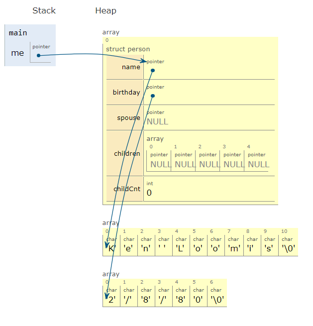

# Week 5 - Family Tree
Remember that each week you will be given a hands-on activity that should
be done using pair programming. This week you will be randomly assigned a
partner from the list of students in your section. Find your partner and use
pair programming to solve the problem. I would suggest that you choose
the student with the least familiarity with coding to be the "driver."
Get some help from the Teaching Fellow if needed. - Ken Loomis

## Part I
Today's task should be a little shorter, so you should have some time to
review some solutions from previous hands-on activities during your section.
Today, you will be implementing a simplistic version of a family tree.

First create a new data type that represents a node in the family tree. This
will represent one person in the tree. It should include their name, birthday,
their spouse, and their children. Since the spouse and children of a person
are also persons, they should be represented with similar nodes. (Hint:
each person node should have several pointers to other people.)

To help with the syntax, I have started the person data type for you.

```C
typedef struct person
{
    // TODO - Task #1
}
person;
```

Create one person in the family tree which represents yourself (or the
partner you are working with). You will not need to collect any user
input to do so, just hard code the values into the person node. You also
do not need to create any additional connections to other nodes at this
time. Since we cannot easily print a complex tree like this, you can
probably assume that it works as long as it compiles.

## Part II
For the next task, build a much larger family tree by creating one person
node at a time and stitch the tree together using pointers. Try to have
at least 3 generations of people in the tree. It is far easier to build
this type of tree if you start with the youngest members of the tree and
work your way backwards to the older members of the tree.

You will likely find it very tedious to do this task manually as there
are many NULL pointers to be set. You may find it helpful to create a
makePerson function which consumes a name and a birthdate, creates the
new person node, and sets the values within the person node. Then the
function should return a pointer to this new person.

To help visualize the results, use the memory visualizer tool that we
discussed during week 4 when we first started talking about pointers:
[http://www.pythontutor.com/visualize.html](http://www.pythontutor.com/visualize.html)



You may end up seeing something like the above image for
one person. And a far more complicated tree when you add more people
to the family tree.